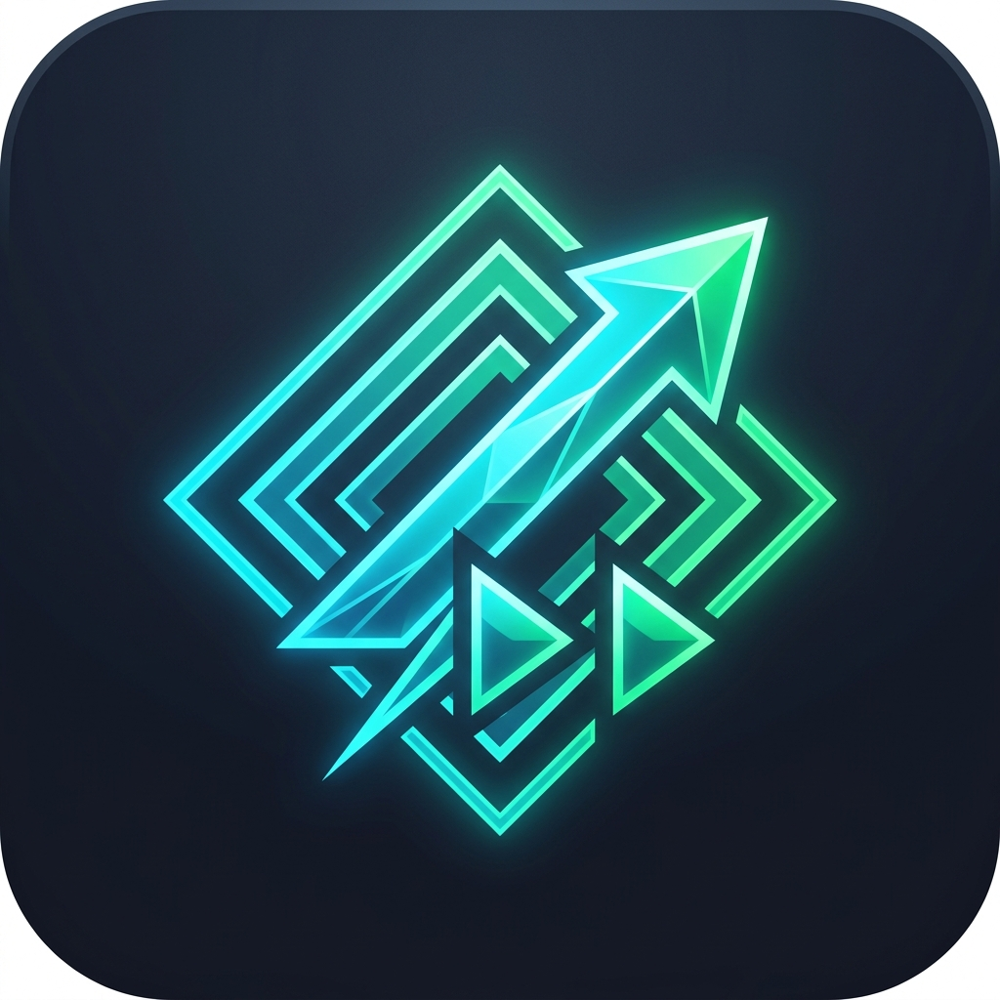

# FusionCut-KMP 🎬⚡

**FusionCut-KMP** is a high-performance, cross-platform NLE video editor for **Windows Desktop** and **Android**, built with **Kotlin Multiplatform (KMP)**, **Jetpack Compose Multiplatform**, and **Dual Native C++20 Render Engines**.



---

## 🚀 Architectural Highlights

- **Dual Native C++ Render Engines (`IFusionEngine`)**:
  - **Windows Engine (`fusion_engine.dll`)**: Written in C++20, compiled via MSVC (Visual Studio Community) with **AVX2 SIMD vectorization** (`_mm256_storeu_si256`) and Windows **Media Foundation GPU Hardware Video Acceleration** (`IMFSinkWriter` / `IMFSourceReader`).
  - **Android Engine (`libfusion_engine.so`)**: Native C++ NDK / OpenGL ES 3.0 scene compositor paired with Android `MediaMetadataRetriever` and `MediaCodec`.
- **Zero-Allocation JNI Pipeline**:
  - Pre-allocated primitive JNI memory buffers (`layerTypes`, `transforms`, `colors`, `dimensions`) eliminate JVM Garbage Collection pauses during real-time 60–120 FPS timeline scrubbing and playback.
- **Subpixel Antialiased Text Typography**:
  - Dynamic string bounds measurement (`FontMetrics` / `Paint.getTextBounds`) prevents text clipping/masking, supporting custom typography, font sizes, bold/italic styles, and colors.
- **Vector Polygon Rasterizer**:
  - Exact mathematical vector shape rasterization for **Circles**, **Rounded Rectangles**, **5-Point Stars**, **Implicit Hearts**, **Triangles**, **Hexagons**, **Capsules**, and **Rectangles** with custom fill and stroke borders.
- **Hardware GPU MP4 Video Export**:
  - Encodes full project compositions directly into `.mp4` video files (`Downloads/FusionCut_<title>_<id>.mp4`) at target resolution and FPS using Windows Media Foundation `IMFSinkWriter`.
- **After Effects / NodeVideo Style Timeline**:
  - CapCut-style multi-track timeline anchored to a fixed center-playhead.
  - Global **Composition Render Cache Status Bar** (Neon Emerald Green line) indicating rendered/cached frame ranges in real-time.
  - Rich **Export Progress Dialog** featuring live rendered frame counters (`Rendered 145 / 300 frames`), percentage, rendered timecode, and a **Cancel Export** button.

---

## 🛠️ Tech Stack & Dependencies

| Component | Technology |
|---|---|
| **Multiplatform Core** | Kotlin Multiplatform (KMP 2.1+) |
| **UI Framework** | Jetpack Compose Multiplatform (Desktop & Android) |
| **Windows Native Engine** | C++20, AVX2 SIMD, MSVC, Ninja, Windows Media Foundation (`mfplat.lib`, `mfreadwrite.lib`) |
| **Android Native Engine** | Android NDK, C++20, OpenGL ES 3.0 / EGL, `MediaMetadataRetriever`, `MediaCodec` |
| **Local Persistence** | Room Database v10 with SQLite Bundled Driver |
| **Concurrency & Flow** | Kotlin Coroutines & `StateFlow` |
| **Dependency Injection** | Custom KMP `AppModule` / `KmpViewModelFactory` |

---

## 📁 Project Structure

```text
FusionCut-KMP/
├── composeApp/                     # Main Application Module (Android & Desktop)
│   ├── src/
│   │   ├── androidMain/            # Android Specific Resources & NDK C++ Code
│   │   │   └── cpp/                # fusion_engine_android.cpp (Android NDK Engine)
│   │   ├── commonMain/             # Shared Jetpack Compose UI Screens & ViewModels
│   │   │   └── kotlin/com/example/
│   │   │       ├── App.kt          # Compose Navigation Host
│   │   │       └── ui/             # Editor, CanvasViewport, TimelineView, ExportDialog
│   │   └── jvmMain/                # Desktop JVM Specific Code & MSVC C++ Engine
│   │       ├── cpp/                # fusion_engine_win.cpp (Windows AVX2 Engine)
│   │       └── resources/          # fusion_engine.dll, icon.png
│   └── build.gradle.kts            # App Build Script & MSVC Native Compile Tasks
├── shared/                         # Shared Business Logic & Engine Interfaces
│   ├── src/
│   │   ├── commonMain/             # IFusionEngine, Project/Layer Data Models, Repositories
│   │   ├── androidMain/            # AndroidFusionEngine, AndroidMediaProvider
│   │   └── jvmMain/                # WindowsFusionEngine, DesktopMediaProvider
│   └── build.gradle.kts
├── gradle.properties
└── README.md
```

---

## 💻 Build & Run Instructions

### Prerequisites
- **Java 21 JDK** (e.g. JetBrains Runtime `jbr-21.0.11`).
- **Android SDK** (Compile SDK 35, Min SDK 24, NDK & CMake 3.22.1).
- **Visual Studio 2026 or 2022 Community** with *Desktop development with C++* workload (`vcvars64.bat`).

### 1. Run Desktop Application (Windows)
```bash
./gradlew :composeApp:run
```

### 2. Compile Windows Native C++ Engine (`fusion_engine.dll`)
```bash
./gradlew :composeApp:compileNativeWindows
```
*Note: This task automatically locates `vcvars64.bat`, invokes CMake + Ninja, compiles `fusion_engine.dll` with AVX2 SIMD optimizations, auto-signs the binary, and bundles it into `src/jvmMain/resources/`.*

### 3. Build Android Debug APK
```bash
./gradlew :composeApp:compileDebugKotlinAndroid
```

### 4. Package Windows MSI Installer
```bash
./gradlew :composeApp:packageMsi
```

---

## 🎬 How To Use

1. **Create Project**: Click **+ New Project**, choose your aspect ratio (16:9 Desktop, 9:16 Shorts/TikTok, 1:1 Square, 4:5 Social), FPS (24, 30, 60), and background color.
2. **Add Shapes & Text**: Click **Add Layer** $\rightarrow$ select **Shapes** (Circle, Star, Heart, Hexagon, Capsule) or **Text** (type custom text with font size and color).
3. **Import Photos & Videos**: Click **Import Image** or **Import Video** to place media clips on the timeline.
4. **Scrub & Edit**: Drag clips along the CapCut-style multi-track timeline, trim start/end boundaries, and inspect live 2D transform parameters (position, scale, rotation, opacity).
5. **Export H.264 MP4 Video**: Click **Export** $\rightarrow$ **Start Export** to watch live frame counters and timecode as the C++ engine renders and saves your `.mp4` video file directly to your **Downloads** folder!

---

## 📄 License

```text
Copyright (c) 2026 devacc2402. All rights reserved.
Licensed under the Apache License, Version 2.0.
```
